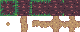

# 3x3-min-gen
3x3 minimal autotile generator from 5 tiles for Godot 3.3

It takes in 5 tiles arranged like the above image and returns a result image like the one below, and a 3x3 minimal autotiled TileSet resource using the result image.

